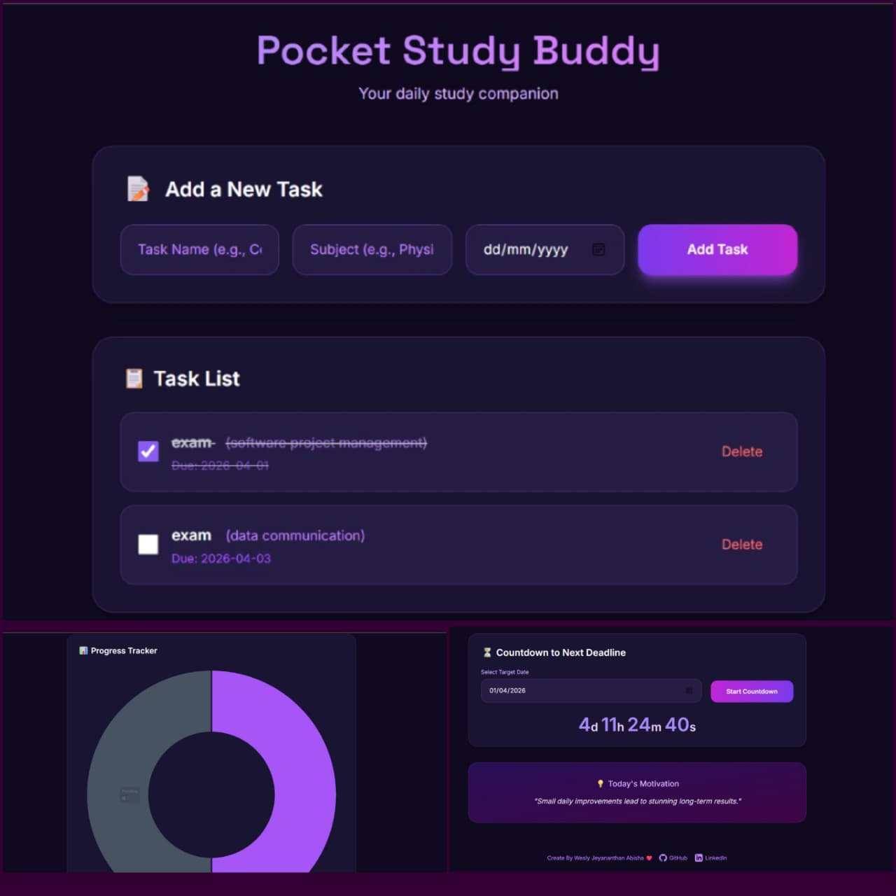

# 📚 Pocket Study Buddy

**Your daily study companion** — beautiful, simple, and powerful.

A single-file web app to help students manage tasks, track progress, count down to deadlines, and stay motivated.

## ✨ Features

- Add tasks with subject & deadline
- Mark tasks as completed
- Beautiful doughnut progress chart
- Countdown timer to next deadline
- Daily motivational quotes
- Fully responsive & modern dark design
- Data saved automatically in your browser (no login needed)

## 🚀 How to Use

1. Open [`index.html`](index.html) in any browser
2. Start adding your study tasks!
3. Everything is saved in your browser using `localStorage`

**No installation. No backend. Works offline.**

## 🛠️ Technologies

- HTML5 + Tailwind CSS
- Chart.js
- Vanilla JavaScript
- localStorage

## 📱 Live Demo

  ## 👉 Click here to open the app (https://abisha71.github.io/pocket-study/)

## 📄 License

Free to use for everyone ❤️

Made with ❤️ for hardworking students by [Abisha](https://github.com/Abisha71)
